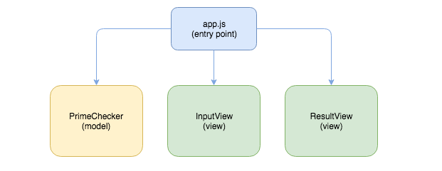
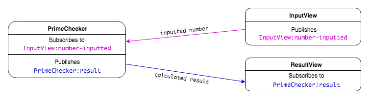

# Intro to the PubSub Pattern

**Lesson Duration: 120 minutes**

### Learning Objectives
- Understand the benefits of breaking up a front-end app into modules / components
- Be able to implement the Publish/Subscribe design pattern
- Be able to build a modular front end

## Intro

As programmers, we want to create well-structured applications so that they are maintainable and extensible. This is something that an architectural pattern can help us do. An architectural pattern informs our decision making around directory and file structure, and the responsibilities of the application's components.

In this lesson we are going to look at one pattern that we can use in our front-end JavaScript applications, the publish-subscribe pattern (pub/sub).

### Single-Page-Applications (SPAs)

Dynamic JavaScript applications often only have one route that the browser uses to make an initial request. This request loads the HTML and other resources including the JavaScript files into the browser. The JavaScript is then used to handle the user interaction, dynamically updating what is rendered to the page in real-time. This replaces the traditional request-response cycle.

A JavaScript application with one route that dynamically renders the page's content is called a Single-Page-Application (SPA). Popular architectural patterns, such as MVC (Model View Controller) are not so applicable to SPAs, because of the lack of a need for controllers that define a set of routes.

### Publish-Subscribe Pattern

If we don't have controllers that are responsible for communicating between the views and models, listening for user interactions and responding with the relevant data, how can we prevent our models and views becoming tightly-coupled (where they are dependent on one another)? To solve this problem we are going to use the publish-subscribe pattern (pub/sub), which is a messaging pattern that allows us to publish data from one part of the application and receive it in another.

In order to understand the pub/sub pattern, let's use the analogy of a radio station and a radio. The radio station broadcasts its content on a certain channel. If you want to listen to the content, you tune your radio to that channel. The pub/sub pattern works just like this. Components can subscribe to a channel and wait for content to be published. Other components can then publish to that channel, sending data to the subscribers.


*Diagram of Pub/Sub pattern, where views and models communicate by publishing on and subscribing to channels*

The pub/sub pattern lets us write loosely coupled components because models and views publish on and subscribe to channels rather than being dependent on each other to communicate. This helps makes our application extensible and maintainable.

## Prime Number Checker

We are going to build an application that allows a user to input a number and check whether it is a prime number or not.


*Screenshot of the Prime Number Checker application that we are going to build*

### Views

We could write all the view logic in one file, but as our applications grow in complexity, it is helpful to handle sections of the view with separate view files. This modularisation of the front end will make our code easier to maintain and extend.

We are going to have a view to handle each dynamic section of the UI: one to handle the user's input and the other to display the resulting message.


*Prime Number Checker Application's Views*

### Models

We are going to have one model that checks whether the number submitted by the user is prime or not.

### Application Architecture



*Application Architecture of Prime Checker*

- app.js is going to be the entry point to the application where all the event listeners are initialised on DOMContentLoaded.
- `InputView` will listen for a number submitted by the user.
- `PrimeChecker` model will be responsible for checking if a number is a prime number and returning a result.
- `ResultView` be responsible for rendering the resulting message to the page.

But how will the inputted number get passed from the InputView to the PrimeChecker model? And how will the model pass the calculated result to the ResultView? Pub/Sub helps us solves this problem.

The InputView will publish the inputted number on a channel that the PrimeChecker model will subscribe to, to receive the number. Then the PrimeChecker model will publish the calculated result on a channel that the InputView will subscribe to, to receive the result.



*Diagram of data flow through Prime Checker application using pub/sub*

## Creating the Application

> Instructor Note: hand out start point

We can see from looking at the package.json we have already installed Webpack, so we can run the start code with:

```sh
npm install
npm run build
open public/index.html
```
Check that you can see the HTML rendering in the browser and that there is a log in the console telling us the JavaScript has loaded.

If we look at the start point we can see we have:
- index.html with the structure of the page, including the input and the result paragraph that will be updated by the JavaScript
- app.js as the entry point for the application where we handle the DOMContentLoaded event
- directories for our models and views with the empty files already created

### Handling the Number Input with InputView

Let's start by creating the InputView that handles the user inputting a number, as this will be the event that triggers the application's data flow.

```js
// input_view.js

const InputView = function () {

};

module.exports = InputView;
```

The responsibility of the InputView is going to be to handle the user inputting a number. We are going to add behaviour to the number input's `input` event. We will do this in a method, which we are going to call `bindEvents` because it will be responsible for setting up the listener for the `input` event. Let's start by accessing the input, which as an ID of 'number' from the DOM.

```js
const InputView = function () {

};

InputView.prototype.bindEvents = function () { // NEW
  const input = document.querySelector('#number');
};
```

Next we will listen for the `input` event by adding an event listener to the input, and log out the inputted number.

```js
InputView.prototype.bindEvents = function () {
  const input = document.querySelector('#number');
  input.addEventListener('input', (evt) => { // NEW
    const inputtedNumber = evt.target.value;
    console.log('inputted number', inputtedNumber);
  });
};
```

If we refresh the browser, will we see the log when the user inputs a number? No, because we haven't called `bindEvents` anywhere, so the listener hasn't yet been added to the `input` event.

### app.js

app.js is the entry point to the application, this is where we need to setup all the listeners when on DOMContentLoaded. You can think of app.js as initialised the application, getting everything ready for the user to interact with it.

Let's new up our InputView and call `bindEvents` to add the listener to the input.

```js
const InputView = require('./views/input_view.js'); // NEW

document.addEventListener('DOMContentLoaded', () => {
  const inputView = new InputView(); // MODIFIED
  inputView.bindEvents(); // NEW
});
```

Now when we refresh the browser and input a number, we see it logged in the console. We now know we have access the the inputted number in InputView.

### PrimeChecker Model

Next we will write the method that does the calculation as to whether a number is prime or not. This calculation is the business logic of the application, so we want to do this in a model. (Views should only be responsible for the rendering of the page.)

```js
// models/prime_checker.js

const PrimeChecker = function() {

};

module.exports = PrimeChecker;
```

A prime number is a number that is divisible only by itself and 1. The method will take in the users inputted number and then for each number between 2 and the inputted number, it will check if the modulus is 0. If so, we know it is divisible by itself and another number, meaning it is not prime, in which case we return false. Otherwise, as long as the number is over 1 (1 is not a prime number), we return true.

```js
const PrimeChecker = function() {

};

PrimeChecker.prototype.numberIsPrime = function (number) { // NEW
  for (let i = 2; i < number; i++) {
    if (number % i === 0) {
        return false;
    }
  }
  return number > 1;
};
```

### ResultView

The last view is the `ResultView` that is going to be responsible for taking the result from the model, and rendering the message to the page.

```js
// result_view.js

const ResultView = function () {

};

module.exports = ResultView;
```

Let's write the method that takes in a result and displays a sentence to the page called `displayResult`. It is going to get the result from the `PrimeChecker` model's `numberIsPrime` method, which we know is going to be either `true` or `false`. We will use this result to update the h3 with the ID of 'result' that is defined in the index.html with a message.

```js
const ResultView = function () {

};

ResultView.prototype.updateView = function (result) { // NEW
  const resultElement = document.querySelector('#result');
  if (result) {
    resultElement.textContent = "Yes! It's a prime number.";
  } else {
    resultElement.textContent = "No. It's not a prime number.";
  }
};
```

## Publishing and Subscribing

Ok, so we have the inputted number in the `InputView`, we have the method to do the calculation in the model `PrimeChecker`, and we have the method to render the result to the page in `ResultView`. But how do we get the inputted number from `InputView` to the `PrimeChecker`? And how do we get the calculated `PrimeChecker` to `ResultView`. This is where the pub/sub pattern will help us:

1. `InputView` is going to publish the number on a channel and `PrimeChecker` is going to subscribe to that channel, in order to listen for the published number.
2. `PrimeChecker` is going to publish the result on another channel and `ResultView` is going to subscribe to the channel to listen for the published result.

### PubSub Helper

So we know we are going to be publishing and subscribing multiple times in the application, therefore it makes sense to create some helper functions, which we can use each time. The PubSub helper is going to be an object that has two functions:

1. `publish` is going to be used to publish data on a channel
2. `subscribe` is going to be used to subscribe to channels in order to receive the data that has been published

```js
// helpers/pub_sub.js

const PubSub = {
	publish: function() {

	},
	subscribe: function() {

	}
};

module.exports = PubSub;
```

## Custom Events

The mechanism we are going to use to do the publishing and subscribing is [Custom Events](https://developer.mozilla.org/en-US/docs/Web/API/CustomEvent).

We have already been using events to send messages in our front-end JavaScript apps, but rather than using an element's predefined events (such as button's `click` event, or a form's `submit` event), we are going to create our own events using the web API's `CustomEvent`s to send data from one component to another.

### `publish`

We are going to start by writing the `publish` method, that will be used by components to publish data out to the rest of the application. It will take two arguments:

1. `channel` - The name of the channel we want to publish on.
2. `payload` - The data we want to publish.

The `publish` method will create a custom event, telling it the name of the event, and giving it the data to attach to the event. The CustomEvent constructor takes the data we want to send in an object with the key `detail`.

```js
const PubSub = {
	publish: function(channel, payload){ // MODIFIED
		const event = new CustomEvent(channel, { // NEW
			detail: payload
		});
	},

	// ..
};
```

The method will also be responsible for dispatching the event.

```js
const PubSub = {
	publish: function(channel, payload){
		const event = new CustomEvent(channel, {
			detail: payload
		});
		document.dispatchEvent(event); // NEW
	},

	// ..
};
```

### `subscribe`

The PubSub's `subscribe` function will be used to handle the subscribing in our application. `subscribe` is going to take in the name of channel to subscribe to, and a callback to execute when the event is dispatched. Adding an event listener to a custom event is exactly the same as adding an event lister to elements' predefined events (a button's 'click' and a form's 'submit') but instead of listening for a predefined event name, we use the name of the custom event and we add the event listener to the document.

```js
// pub_sub.js

const PubSub = {
	// ...

	subscribe: function(channel, callback){ // MODIFIED
		document.addEventListener(channel, callback); // NEW
	}
};
```
Now we have our PubSub helper object that we can use throughout our application.

### Publishing in InputView

Let's make use of the `PubSub.publish` in InputView. We will require in the PubSub helper object.

```js
// input_view.js

const PubSub = require('../helpers/pub_sub.js'); // NEW
```

When the input event is triggered, we will publish the inputted number by calling the publish method passing it two arguments:

1. The name of the channel we want to publish on - `'InputView:number-inputted'`
2. The data we want to publish - `inputtedNumber`

```js
InputView.prototype.bindEvents = function () {
  const input = document.querySelector('#number');
  input.addEventListener('input', (evt) => {
    const inputtedNumber = evt.target.value;
    PubSub.publish('InputView:number-inputted', inputtedNumber); // MODIFIED
  });
};
```

### Channel Naming

The name of the channel (custom event) can be anything, but we are using the name of the component doing the publishing, followed by the name of the event. This will enable us to more easily trace the data flow around the application, because when we subscribe to a channel, we will see where the data has been published from.

### Subscribing in PrimeChecker

Next we want the PrimeChecker model to subscribe to the InputView's `'InputView:number-inputted'` channel so that PrimeChecker can receive the inputted number being published by the InputView. Again, because we are setting up a listener, we are going to do it in a method call `bindEvents`.

```js
// prime_checker.js

const PrimeChecker = function() {

};

PrimeChecker.prototype.bindEvents = function () { // NEW

};
```

We are going to subscribe to the InputView, so that when InputView publishes the inputted number, PrimeChecker can access it. We are going to be using the PubSub helper object, so we need to require it and call its `subscribe` function.

```js
const PubSub = require('../helpers/pub_sub.js'); // NEW

const PrimeChecker = function() {

};

PrimeChecker.prototype.bindEvents = function () {
  PubSub.subscribe(); // NEW
};
```

`PubSub.subscribe` takes two arguments. The first is the channel name it is going to listen on, which in this case is 'InputView:number-inputted'. The second argument is the callback we want it to execute when the inputted number is received.

```js
PrimeChecker.prototype.bindEvents = function () {
  PubSub.subscribe('InputView:number-inputted', (event) => { // MODIFIED

  });
};
```

Now we need to access the number that was published with the event. Previously we have been using `event.target.value` to get the value of a user interaction from inputs. As we attached the data being published to the key `detail`, with custom events we access the data published with `event.detail`.

```js
PrimeChecker.prototype.bindEvents = function () {
  PubSub.subscribe('InputView:number-inputted', (event) => {
    const inputtedNumber = event.detail; // NEW
    console.log(inputtedNumber); // NEW
  });
};
```

Again, this currently won't have any effect, because we haven't called PrimeChecker's `bindEvents` anywhere. We set up all listeners in app.js, the entry point to our application. We need to new up a model and call its `bindEvents` in app.js.

```js
// app.js

const InputView = require('./views/input_view.js');
const PrimeChecker = require('./models/prime_checker.js'); // NEW

document.addEventListener('DOMContentLoaded', () => {
  const inputView = new InputView();
  inputView.bindEvents();

  const primeChecker = new PrimeChecker(); // NEW
  primeChecker.bindEvents(); // NEW
});
```

Great, now when when we click the button, we can see it logged out in the model! We have passed the data from view to model. We have just used Pub/Sub to pass data from a view to a model.

### Calculating the Result

The next step is to check whether the number is prime or not, using the `numberIsPrime` method. We want to do this when PrimeChecker receives the inputted number from InputView. We will log the result.

```js
// ...

PrimeChecker.prototype.bindEvents = function () {
  PubSub.subscribe('InputView:number-inputted', (event) => {
    const inputtedNumber = event.detail;
    const result = this.numberIsPrime(inputtedNumber); // MODIFIED
    console.log(result); // NEW
  });
};
```

Now when we refresh the browser and input a number we see `true` or `false` being logged out, telling us whether the number is a prime number or not.

### Publishing in PrimeChecker

We now need to get this result from the model to our final view, so let's publish it out on the channel 'PrimeChecker:result'.

```js
PrimeChecker.prototype.bindEvents = function () {
  PubSub.subscribe('InputView:number-inputted', (event) => {
    const inputtedNumber = event.detail;
    const result = this.numberIsPrime(inputtedNumber);
    PubSub.publish('PrimeChecker:result', result); // MODIFIED
  });
};
```

We are now publishing out the result to the application, we need to access it in ResultView by subscribing to the channel, 'PrimeChecker:result'.

### Subscribing in ResultView

We are going to subscribe to 'PrimeChecker:result' in ResultView. Again, because this is going to be a listener that waits for the publishing of the result, we are going call the method responsible for doing this bindEvents. We will log out the result data that was attached to the event, with `event.detail`.

```js
// result_view.js

const PubSub = require('../helpers/pub_sub.js'); // NEW

const ResultView = function () {

};

ResultView.prototype.bindEvents = function () { // NEW
  PubSub.subscribe('PrimeChecker:result', (event) => { // NEW
    const result = event.detail;
    console.log(result);
  });
};
```

And let's call that in app.js on DOMContentLoaded so the listener is ready waiting for the user interaction.

```js
// app.js

const InputView = require('./views/input_view.js');
const PrimeChecker = require('./models/prime_checker.js');
const ResultView = require('./views/result_view.js'); // NEW

document.addEventListener('DOMContentLoaded', () => {
  const inputView = new InputView();
  inputView.bindEvents();

  const primeChecker = new PrimeChecker();
  primeChecker.bindEvents();

  const resultView = new ResultView(); // NEW
  resultView.bindEvents(); // NEW
});
```

Now when we refresh the browser and input a number, we see the ResultView's log of the result.

### Displaying the Result in ResultView

Now we can call `displayResult` at the point we receive the result, which will update the page with the message.

```js
// result_view.js

ResultView.prototype.bindEvents = function () {
  PubSub.subscribe('PrimeChecker:result', (event) => {
    const result = event.detail;
    this.updateView(result); // MODIFIED
  });
};
```

And now when we refresh the page, we should see the result being rendered to the browser.

We have successfully built an application with models and views, using PubSub to pass data around the application.

## Namespaces

When choosing names for your custom events, you should make sure that there is no possibility of a clash with other components.

We have been following the convention: `ComponentName:event-description`. This has the added benefit of making the data flow explicit, because we can see which component the data is coming from when subscribing.

## Recap

What can we use to help guide us in thinking about what order to build a pub/sub application?

<details>
<summary>Answer</summary>

Event and data flow. We can start by thinking about what event is going to start the data flow. In this case, it was the user inputting a number. We then passed that number to the model to do the calculation, and lastly rendered the resulting message to the screen.

</details>

What is app.js the responsible for?

<details>
<summary>Answer</summary>

app.js is the entry point for the application. It handles the DOMContentLoaded event, which is where we want to initialise all the event listeners for the application, so that when a user starts to interact with the page, it will be ready to handle the input.

</details>

## Conclusion

We've seen that the publish / subscribe pattern using custom events provides us with a messaging pattern that allows us to send data between components. This has enabled us to write decoupled components. If we wanted to drop our `PrimeChecker` model into another app, we wouldn't need to do much refactoring to be usable in other contexts.

Reasoning about the data flow can be difficult. Including the component name in the event name helps us trace where data is coming from.
